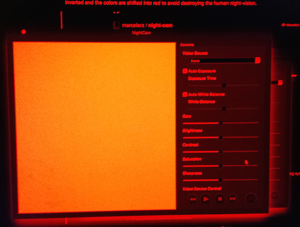

# NightCam

Webcam recording application for Mac to record low-light scenes


This can be used for example to record Astronomical objects with a simple webcam.

## Download
There is a pre-compiled universal binary in the ```dist``` folder. Give it a try.

## Features

The Apple+B key-combination turns the screen into night-vision mode. The colors of the operating system will be inverted and the colors are shifted into red to avoid destroying the human night-vision.



(Sorry, this is a photo of my screen since a screenshot won't work - only the display colors are changed)

Also, the application supports the following options during video recording:
* Auto Exposure
* Custom Exposure with Slider
* Auto White Balance
* Custom White Balance with Slider
* Gain with Slider
* Brightness with Slider
* Contrast with Slider
* Saturation with Slider
* Sharpness with Slider


## Issues
The FaceTime HD Camera that is built into Macs does not support the option to modify these values - any change to the above mentioned options do not have an effect on these webcams. However, cheap USB cameras usually support these modifications. Go figure.

## License

MIT

